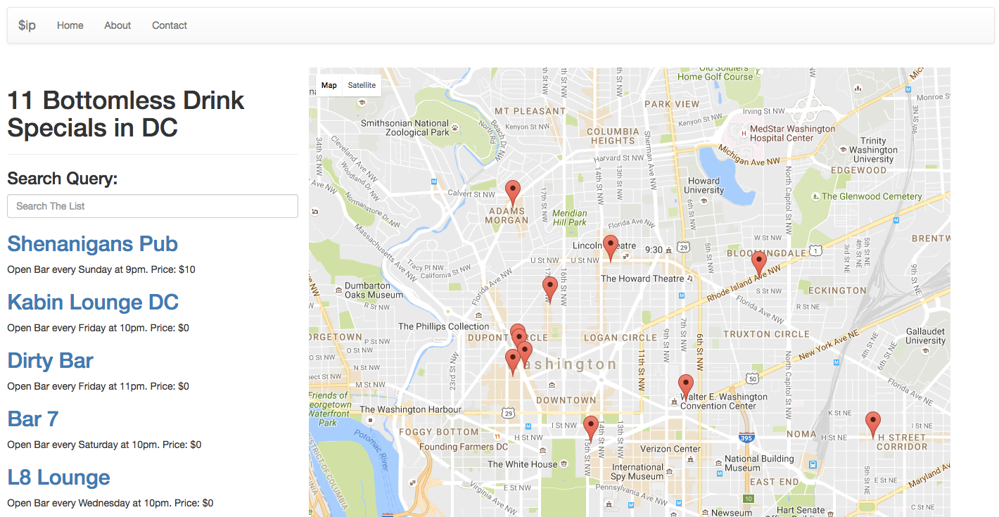

# $ip: A MEAN Stack App for Tracking Cheap Bottomless Drinks in D.C.
### Project 4 for General Assembly's Full-Time Web Development Course

***

## Background Story
Going out on a budget is hard. After spending 14 weeks unemployed while attending General Assembly, going out is almost impossible without busting your budget for the week.

Every night, my friends and I researched bars with the best drink specials. The number one question in mind... where are all of the drink specials? And $ip was born.

$ip will only show you bottomless drink specials that are under $15. In most cases, the drink special is FREE!

## Technologies Used
$ip is a full CRUD, MEAN Application with a Google Maps API. It's built with AngualarJS, MongoDB, Mongoose, Express, Nodejs and Google Maps API for Plotting Data on the Map.

## Upcoming Features
  1. Remove the show view and corresponding show router and use modals instead, making it a true SPA.
  2. When you click on a marker on the map, details appear regarding the location.
  3. Adding Google Places API, so users can search inside the Google Map for locations.

## How To Run App
```
$ npm install
```
```
$ mongod
```
```
$ nodemon index.js
```

## Screenshots of $ip


